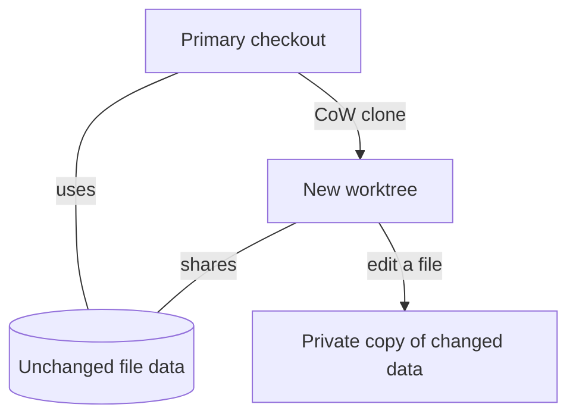

# CoW Worktree

`dev.afaz.cow-worktree` is a Herdr plugin for creating a new Git worktree from your current, already-set-up checkout.

A regular Git worktree gives you the tracked files from the repository, but it does not bring along ignored files. This usually means installing dependencies again, recreating local configuration, and rebuilding generated files before the new worktree is ready to use.

CoW Worktree instead makes a **copy-on-write clone** of the complete checkout. The new worktree starts with the same dependencies, build caches, local configuration, and other ignored files as the primary checkout. Because the filesystem initially shares the unchanged file data, creating it can be much faster and use much less additional disk space than making a normal copy.

When either worktree changes a file, the filesystem stores a separate copy of the changed data. Changes in one worktree therefore do not change the other.



## Why use it instead of a regular worktree?

| Regular Git worktree | CoW Worktree |
| --- | --- |
| Checks out tracked files | Clones the complete existing checkout |
| Ignored files are absent | Ignored files are included |
| Dependencies may need to be installed again | Existing dependencies are immediately available |
| Local configuration and caches must be recreated | Local configuration and caches come along |
| Creates an independent set of working files | Initially shares unchanged filesystem data |

This is most useful for projects with large dependency directories or expensive setup steps—for example, a JavaScript project with a large `node_modules` directory. You can open a new branch in a separate Herdr workspace and begin working without repeating that setup.

> **Important:** cloning the complete checkout also clones ignored secrets such as `.env` files. The creation prompt warns about this before continuing.

There is deliberately no ordinary-copy fallback. If the filesystem cannot create copy-on-write clones, the operation fails instead of silently making a full copy.

## Requirements

Supported platforms:

- macOS (APFS or another filesystem supported by `clonefile(2)`), with a native compiler toolchain
- Linux on a filesystem supporting forced file reflinks

Node.js 20.1+, npm, and Git are required. Linux preserves modes and timestamps, but does not promise ACL or extended-attribute preservation. Symlinks are recreated without following them; sockets, FIFOs, and device files are skipped and reported.

The plugin requires Herdr 0.9.1 or newer.

## Using the plugin

Invoke **Create CoW worktree** from a workspace action menu. The action opens a popup showing:

- the automatically generated branch name;
- the destination directory; and
- the primary checkout being cloned.

Press Enter to confirm. The destination follows Herdr's `<worktrees.directory>/<repo>/<branch>` convention. After creation, the new worktree opens in Herdr automatically.

You can optionally bind the action in `~/.config/herdr/config.toml`:

```toml
[[keys.command]]
key = "prefix+shift+w"
type = "plugin_action"
command = "dev.afaz.cow-worktree.create"
description = "create CoW worktree"
```

The native Herdr worktree creator is unchanged. This plugin adopts its completed checkout with `herdr worktree open`, so adoption emits `worktree.opened` rather than `worktree.created`.

## Local development

```sh
npm ci
npm run build
npm test
herdr plugin link "$PWD"
```

## Safety and failure behavior

The primary checkout must have no tracked changes or non-ignored untracked files. The popup explicitly warns before cloning ignored content. Clone construction occurs under a hidden staging path and becomes visible through an atomic rename. Failures remove plugin-owned worktree metadata, staging paths, and the new branch only while it still points to the captured source HEAD. Submodules initialized in the primary checkout are initialized in the result; their failure rolls back creation.

If Herdr adoption fails after Git creation succeeds, the worktree is intentionally retained and the popup prints the exact recovery command.
